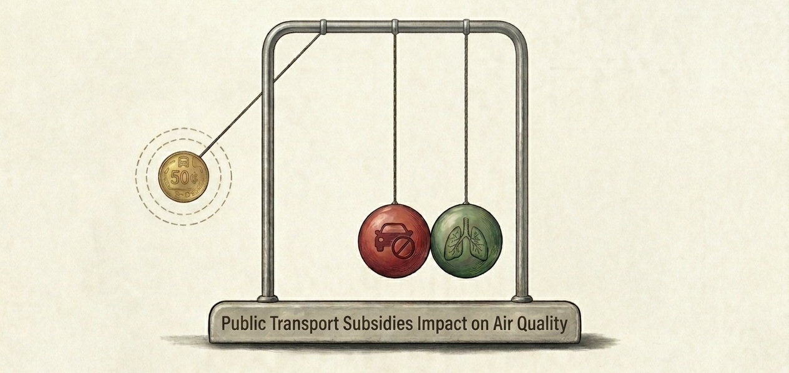

## Selected Projects in Applied Economics

---
### Structural Airline Merger Simulation (IN PROGRESS)

Developing a structural merger simulation of the US airline industry using real-world market data. I am planning to estimate discrete-choice demand models (Logit, Nested Logit, and potentially BLP), recover marginal costs from firms’ pricing decisions, and simulate how a merger would affect equilibrium prices and competition across overlapping routes.

---

### Queensland’s 50-Cent Fare Policy and Air Pollution

This project evaluates whether subsidising public transport reduces urban air pollution. Using a difference-in-differences approach with station-level data from Brisbane and Adelaide, the analysis finds no robust evidence of a reduction in PM2.5 concentrations in the first year after implementation.

**[Access Full Report (PDF)](Queensland_50cent_Fare_Policy_Report.pdf)**

[View code on Colab](https://colab.research.google.com/drive/1i47e3yKrRuUrCE5xWv7ySpSNEBQc4Qnr)

---

